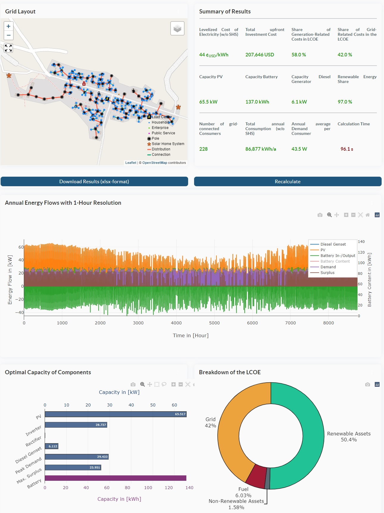
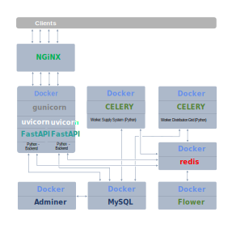

---
#  The Tool
The open-source tool originated from the PeopleSuN project and serves the planning of off-grid systems in Nigeria. The tool aims to perform a spatial optimization of the distribution grid as well as the design of the energy converters and energy storage.

## Features
The features of the tool are listed below:
- **Automatic Identification of Buildings from OpenStreetMap:** Utilizes OpenStreetMap data to automatically identify building locations.
- **Spatial Optimization of the Distribution Grid:** Enhances the efficiency of the distribution grid through spatial optimization techniques.
- **Design Optimization of Generation Systems:** Optimizes the design of PV systems, battery systems, inverters, and diesel-engines.
- **Automatic Identification for Individual Solar Home Systems:** Identifies buildings that are more suitably served by individual solar home systems.

---
# Server Configuration and Docker-Container

The following describes the server configuration created for the Optimization Tool, aimed at ensuring secure and reliable operation. Client requests are received by NGINX, a so-called reverse proxy server, which establishes encrypted communication using SSL/TLS certification and forwards them to the appropriate destinations. The web tool consists of several applications, including database systems and applications for database visualization, monitoring of asynchronous tasks, user data analysis, and load management.


<ins>**Web Application Container**</ins>  
This container hosts the actual web application, responding to NGINX requests. It includes the FastAPI application, website elements like HTML, CSS, and JavaScript, database interfaces, and energy system models. It runs Gunicorn, a Python-based HTTP server, supporting multiple worker processes to handle requests and enable parallel operation of FastAPI instances. The container also includes the open-source CBC solver for mixed-integer linear programming, as a fallback when no licensed Gurobi solver is available.

<ins>**MySQL Container**</ins>  
Hosts a MySQL database system for storing user account data and input/output data of energy system models.

<ins>**Adminer Container**</ins>  
Adminer, a web-based database management tool, provides a user interface for database systems like MySQL and visualizes the databases.

<ins>**Celery Container**</ins>  
Celery, a task queue system, is used for asynchronous tasks like optimizing energy models and deleting temporary user accounts after a set period. It ensures the FastAPI application continues to handle user requests during model solving, preventing overload of memory and CPU resources.

<ins>**Redis Container**</ins>  
Redis, an in-memory database, acts as a message broker, managing communication between Celery tasks and the web server. It transfers tasks from the FastAPI application to the Celery container and retrieves their status.

<ins>**Flower Container**</ins>  
Flower provides a web-based interface for monitoring and managing the Celery task queue, housed in a separate Docker container.
---
# Instructions for Setting Up the Project
This tool is designed to operate within a Docker environment, with detailed instructions provided below. Should you wish to modify or further develop the tool, it is possible to run it outside of a Docker environment as well. Comprehensive guidelines for this approach are also available below. In such cases, however, you must have a MySQL database running (refer to the provided description). In both scenarios, the following initial steps are required:
1. **Download the Project:**
   First, download the project from GitHub by visiting [this link](https://github.com/rl-institut/tier_spatial_planning/).
2. **Switch to the Project Directory:**
   After downloading, open your terminal and switch to the project directory by running:
   ```bash
   cd path/to/project
   ```
   Replace `path/to/project` with the actual path where you downloaded the project.
3. **Adjust Docker Secrets:**
   In the /secret directory, modify the default settings according to your preferences (without quotes and without linebreaks):  
   <ins>Note</ins>: These secrets are required even if you are not running the project in a Docker environment.
   - `secret.txt`: Contains the password used for MySQL.
   - `mail_secret.txt`: Contains the password of the used email/email service.
   - `key_for_token.txt`: Contains the key used to generate user access tokens.
   - `cds_api_key.txt`: An API key is needed for the download of ERA5 data (https://cds.climate.copernicus.eu/api-how-to). If you're running the app outside Docker and the file $HOME/.cdsapirc with the API key already exists, there's no need to provide the API key separately. Simply retain the placeholder value in the secret.
   - `example_user_secret.txt`: Contains the password of the database example user account (used for the example project).
4. **Adopt the Parameter Values in the `app.env`-File:**  
   Adjust the parameters in the app.env file to fit your application's specific needs. This includes settings related to various functionalities of the application. It's particularly important to provide accurate values for the email-sending variables. If these mail parameters are not correctly configured, the application will be unable to send activation emails. This lack of email functionality becomes a critical issue during user registration, as new users will not receive the necessary activation links, requiring you to manually activate each user account in the database.

These steps ensure that you are prepared to either proceed with Docker integration or work in a non-Docker environment as per your preference. Remember to refer to the specific instructions for setting up and maintaining the MySQL database when not using Docker.

<ins>Note</ins>: Before publishing the app, ensure to include legal information and privacy statements (refer to the section at the end of this document).

## Running the App in Docker Environment (Production Environment)
1. **Run Docker Compose on Linux:**
   If you're using a Linux system, set up your Docker environment by executing the following command in the terminal. This command sets your user ID and group ID for the database and starts the Docker containers:
   ```bash
   UID_FOR_DB=$(id -u) GID_FOR_DB=$(id -g) docker-compose up -d
6. **Downloading Weather Data:**  
   When the app is executed for the first time, it automatically creates all necessary database tables and initiates the process of downloading and importing weather data into the database. "This download and import process usually takes about 2 hours, mainly due to the time spent waiting for https://cds.climate.copernicus.eu/api/v2 to process the request. During this time, please refrain from interrupting the process to ensure a complete and successful setup. (If an SQL dump file is provided under /fastapi_app/data/weather.sql, it will be imported and the need for downloading is eliminated. This process only takes a few minutes.)

## Running the App without Docker Environment (Development Environment):
1. **Install MySQL:** Begin by manually installing MySQL (server and client). If you prefer a graphical interface, you may also install MySQL Workbench.
2. **Create Database User:**
   - Create a new database user with the username specified in your `app.env` file.
   - Set the password for this user as defined in your Docker `secret.txt`.
3. **Grant Privileges and Create Database:**
   - Grant the necessary privileges to the newly created user.
   - Create a database with the name you've specified in `app.env`.
4. **Virtual Environment and Package Installations:**
   - Create venv with `pyhton 3.8` (pip or conda env)  

   if you use pip, execute:
   - `pip install -r requirements.txt`
   - `pip install --no-deps -r no_deps_requirements.txt`
5. **Run the Application:**
   - Execute `run.py` to start the application. This script uses Uvicorn to run the app.
   - Once running, the web application should be accessible at [http://localhost:40000](http://localhost:40000).
6. **Downloading Weather Data:**  
   When the app is executed for the first time, it automatically creates all necessary database tables and initiates the process of downloading and importing weather data into the database. "This download and import process usually takes a few hours, mainly due to the time spent waiting for https://cds.climate.copernicus.eu/api/v2 to process the request. During this time, please refrain from interrupting the process to ensure a complete and successful setup. (If an SQL dump file is provided under /fastapi_app/data/weather.sql, it will be imported and the need for downloading is eliminated. This process only takes a few minutes.)

---
# Create Example Project
   Upon startup, a user account with the username `default_example` is created, using the password specified in the Docker secret `example_user_account.txt`. Please log into this account and create a project. The first project created under this account will be used as the default example for other users.

---

# Access the web app as well as the additional services with a graphical user interface.
1. When the Docker containers are running or `run.py` is executed, the web application can be accessed at http://localhost:40000.

   <ins>Note</ins>: The following services are only available when the project is run in a Docker environment.  

2. The MySQL Docker container is configured to listen on port 40001. You can connect to it for visualization purposes using tools like MySQL Workbench. To establish a connection, use the address [127.0.0.1:40001](127.0.0.1:40001).
3. An overview of the tasks in the task queue (Celery) is available at [http://localhost:40002](http://localhost:40002).
4. A graphical user interface for the database (Adminer) is accessible at [http://localhost:40003](http://localhost:40003)  

---
# Domain Linking and SSL Encryption
Enhancing security and ensuring proper domain routing for our Dockerized web app necessitates the use of an external proxy server. In our configuration, a proxy is not integrated into the Docker setup and needs to be configured separately. It is advised to implement a proxy, such as Nginx, to efficiently direct domain requests to port 40000 while managing SSL encryption. Enabling "Header forwarding" is crucial for the seamless operation of the app. To assist with this process, an example Nginx configuration file is provided, helping streamline the integration of these essential features.  
Example configuration file for nginx:  
   Replace `>your_domain.com<` and `>Your Server IP<` and insert `ssl_ciphers value`
```bash
   # ansible provided config file---changes will be lost


server {
  listen      80;
  server_name >your_domain.com<;
  rewrite     ^(.*)   https://$server_name$1 permanent;
}


server {
  listen      443 ssl;
  server_name >your_domain.com<;
  root /var/www/html;

  # the ssl parameters start here
  ssl_certificate           /etc/letsencrypt/live/>your_domain.com</fullchain.pem;
  ssl_certificate_key       /etc/letsencrypt/live/>your_domain.com</privkey.pem;
  ssl_session_timeout       5m;
  ssl_protocols             TLSv1 TLSv1.1 TLSv1.2;
  ssl_prefer_server_ciphers on;
  ssl_ciphers               "";
  # the ssl parameters end here

  error_log /var/log/nginx/peoplesun.error.log;
  # the locations start here
  # BEGIN ANSIBLE MANAGED BLOCK location for peoplesun app proxy
  location / {

    keepalive_timeout 5;
    client_max_body_size 4G;

    proxy_pass             >Your Server IP<:40000;
    proxy_redirect        off;
    #proxy_pass_header Server;
    ## be careful, this line doesn't override any proxy_buffering on set in a conf.d/file.conf
    proxy_buffering off;
    proxy_set_header X-Real-IP $remote_addr;  # http://wiki.nginx.org/HttpProxyModule
    proxy_set_header X-Forwarded-For $proxy_add_x_forwarded_for;
    proxy_set_header X-Forwarded-Proto $scheme; # for EP to set secure cookie flag when https is used
    proxy_set_header Host $host;  # pass the host header
    proxy_http_version 1.1;  # recommended with keepalive connections
    ## WebSocket proxying - from http://nginx.org/en/docs/http/websocket.html
    proxy_set_header Upgrade $http_upgrade;
    proxy_set_header Connection $connection_upgrade;
  }
  # END ANSIBLE MANAGED BLOCK location for peoplesun app proxy
  # the locations end here

}

# BEGIN ANSIBLE MANAGED BLOCK map http connetions to upgrade by default
# we're in the http context here
map $http_upgrade $connection_upgrade {
  default upgrade;
  ''      close;
}
# END ANSIBLE MANAGED BLOCK map http connetions to upgrade by default

```
---
# Providing legal information and privacy statements
Before the tool is made publicly available, it's crucial that an imprint (legal notice) and privacy statements are already integrated. In the footer of every page of the web application, links to the privacy policy page are included, directing users to the /privacy subpage. This page can be found at `/fastapi_app/static/pages/legal_notes.html`. When a user accesses this page, the files `_imprint_de.html`, `_imprint_en.html`, `_privacy_de.html`, and `_privacy_en.html` (available in both German and English) are dynamically included in the response template through Jinja2 commands. The necessary content for these legal notices and privacy statements should be prepared and inserted into these files in advance.
```
    <section class="dashboard">
        <div style="text-align: left">
            
                
                    
                
                    
                
            
                
                    
                
                    
                
            
        </div>
        >
    </section>
```
